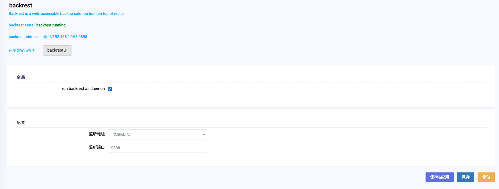

# 仅支持x86_64   

---

**介绍**

Backrest 是一款基于 [restic](https://restic.net/) 构建的可通过 Web 访问的备份解决方案。Backrest 提供了一个 WebUI，它封装了 restic CLI，可轻松创建存储库、浏览快照和恢复文件。此外，Backrest 可以在后台运行，并采用自定的方法来安排快照和协调存储库健康操作。

# backrest-OpenWrt

-   backrest
-   luci-app-backrest

## 安装命令
```
wget https://github.com/ykxVK8yL5L/backrest-openwrt/releases/download/v1.0.1/backrest_1.6.1-1_x86_64.ipk   
wget https://github.com/ykxVK8yL5L/backrest-openwrt/releases/download/v1.0.1/luci-app-backrest_1.0.1_all.ipk   
wget https://github.com/ykxVK8yL5L/backrest-openwrt/releases/download/v1.0.1/luci-i18n-backrest-zh-cn_git-24.309.31899-1cc9a85_all.ipk   
opkg install backrest_1.6.1-1_x86_64.ipk 
opkg install luci-app-backrest_1.0.1_all.ipk  
opkg install luci-i18n-backrest-zh-cn_git-24.309.31899-1cc9a85_all.ipk 
```

## Screenshot

### luci-app-backrest



## 所用项目
[restic](https://restic.net/)   
[backrest](https://github.com/garethgeorge/backrest)


## FAQ

## License

GNU General Public License v3.0
